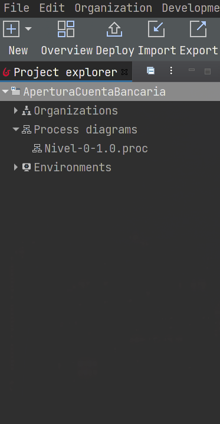

# Apertura de cuentas bancarias

Proyecto GPN 2-2021

## Instalación

Instalación en linux

1. Ir a la carpeta de donde se instaló Bonita Studio
```bash
# Especifica la carpeta de instalación de Bonita
# en esta variable, el valor es un ejemplo
BONITA_DIR=$HOME/BonitaStudioCommunity-2021.2-u0

cd $BONITA_DIR/workspace
git clone git@github.com:diegosanchezp/proyecto-gpn.git AperturaCuentaBancaria
```

2. Abrir Bonita Studio
3. Abrir AperturaCuentaBancaria

```
File > Switch project
```
4. Seleccionar AperturaCuentaBancaria

Verificar que aparezcan los diagramas en Proccess diagramas

